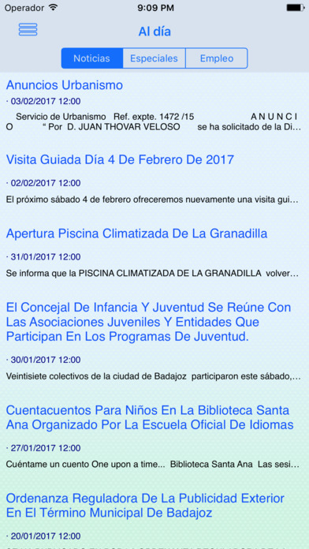

# iBadajoz-iOS

This repo contains the sources of the iOS application [iBadajoz](https://itunes.apple.com/es/app/ibadajoz/id492209827?mt=8)

## Dependencies

The information about buses is fetched from AWS, take a look to [this repo](https://github.com/dcordero/Tubasa) for further information
